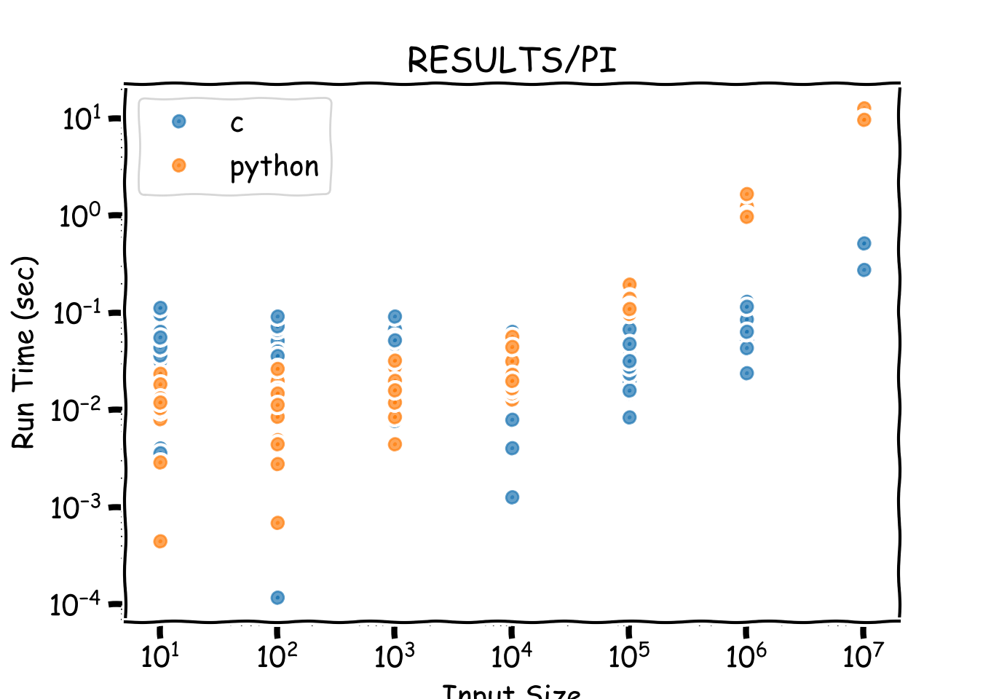
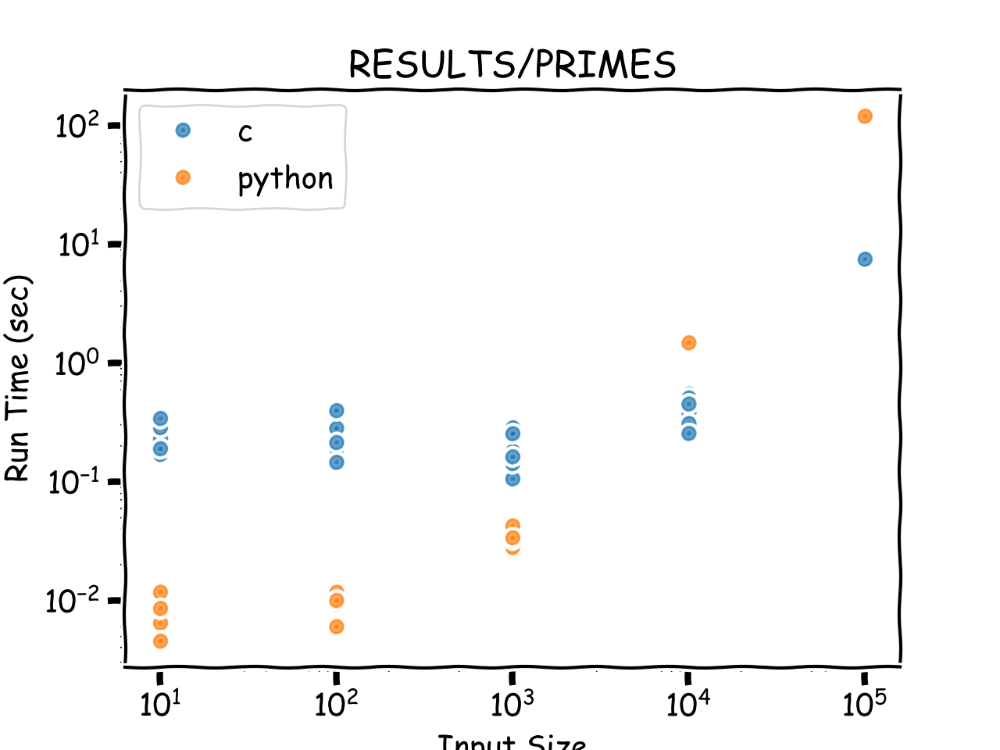

# Python vs C MPI Performance Comparison

## Project Spec
> "I would make a recommendation of comparing at least 3 different MPI algorithms performance in C/C++ vs the same algorithm in Python or Rust as your primary inquiry question. Opt for a dockerized comparison as an add-on if you have time. I’ve gotten MPI running in K8s and it was far from trivial and that was ignoring the testing, algorithms, etc that I would want you to write to test the performance differences."

### Testing Scripts
#### comp.sh
`usage: ./comp.sh ALGORITHM_NAME N`

Runs both the Python and C implementations of specified algorithm with MPI and saves timing information to `/results/ALGORITHM_NAME.csv`

#### test.sh
`usage: ./test.sh ITERATIONS SIZES`

Calls the comp.sh script repeatedly with varying sizes. Will run comp.sh `ITERATIONS` number of times with for each input size, and will run input sizes from `10^1` to `10^SIZES`.

### Testing methodology
For each of the 3 algorithms, tested input sizes from 10^1 to 10^7 for 5 runs. 

### Results

