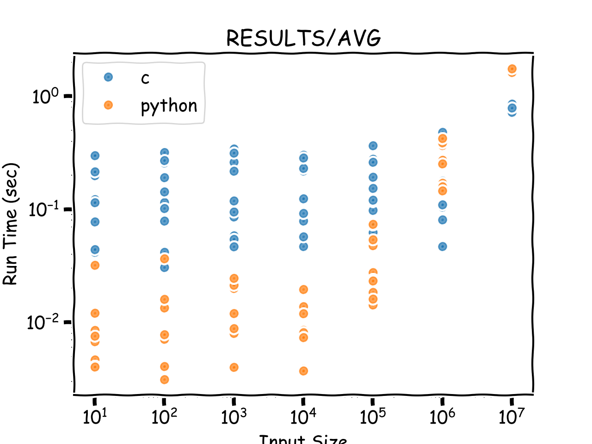

My goal with this project was to compare 3 different MPI algorithms’ performance in C vs the same algorithms in Python. The 3 algorithms I chose were one to count primes up to a given number, one to compute the average of randomized list of given size, and one to calculate pi to a given accuracy. 

My hypothesis, based on the baseline performance of non-MPI Python vs C, was that MPI C code would be much more performant than the same algorithms in Python. My results show that this hypothesis is mostly, but not always, correct. For small input sizes, Python often outperformed C, but as input sizes grew, C massively outperformed Python. Below are graphs of of my results for all three algorithms. 

